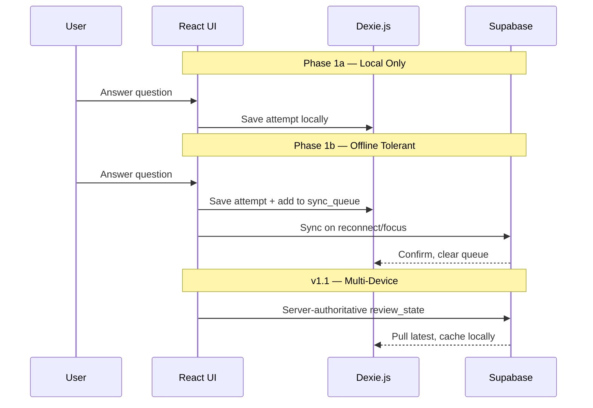

# GABAY — Consolidated Review & Handoff Document

> **Purpose:** Single source of truth synthesizing the original implementation plan and four independent reviews, for handoff to Antigravity (Claude Opus 4.6) to produce the final executable implementation plan.
>
> **Date:** July 19, 2026
> **Prepared by:** Composer (fourth reviewer), consolidating Antigravity + GLM 5.2 + Ilym + Kimi 2.7
> **Audience:** Antigravity Desktop (Claude 4.6) — planning phase only; no code in this document.

---

## Source Documents

| Document | Author / Reviewer | Role |
|---|---|---|
| [implementation_plan.md](implementation_plan.md) | Antigravity (Claude Opus 4.6) | Original design specification — 11 components, 14 screens, schema, architecture |
| [glm 5.2 gabay-plan-assessment.md](glm%205.2%20gabay-plan-assessment.md) | GLM 5.2 | Scope discipline, CMS urgency, multi-device architecture, revised phases |
| [ilym gabay_plan_review.md](ilym%20gabay_plan_review.md) | Ilym | PH market ops, DPA, notifications, guest merge, content velocity, framework nuance |
| [kimi 2.7 gabay-review-feedback.md](kimi%202.7%20gabay-review-feedback.md) | Kimi 2.7 | MVP scoping, offline-tolerant approach, free tier, auth, operational layers |

**Reference (not in this folder):** [gabay-exam-coach-blueprint.md](file:///c:/Users/ACER/OneDrive/Desktop/ZPPSU%20A.Y.%202026-2027/My%20Project/Board%20Exam%20Reviewer%20Web%20App/gabay-exam-coach-blueprint.md) — Gemini ideation + Claude Fable critique that preceded the implementation plan.

---

## 1. Executive Summary

GABAY is an AI Exam Coach PWA targeting Filipino CSE-PPT examinees. The original implementation plan is **pedagogically excellent and unusually market-aware** — it identifies six real blueprint gaps (offline architecture, compressed spaced repetition, test anxiety, pacing calibration, 3-point confidence scale, error pattern classification) and addresses them with evidence-based design.

**Unanimous verdict across all four reviewers:** The vision is build-ready. The plan as written is a **v1.5–v2.0 product specification**, not a lean MVP. Phase 1 (Aug–Oct 2026) tries to deliver 11 components with offline sync, payments, mock exams, analytics, and anxiety management — realistically **2–3x too much** for a solo or small team.

**Consensus path forward:**

1. Ship a **thin vertical slice** — one subtopic, 20–30 golden questions, core study loop only
2. Build the **content authoring tool in Phase 1a**, not during the content sprint
3. Treat offline as **local-first → offline-tolerant → hardened sync** (progressive enhancement)
4. **Single-device MVP**; multi-device sync deferred to v1.1 with server-authoritative state
5. Protect the **coaching voice and pedagogy** during all scope cuts — that is the differentiator

**Top 3 risks (ordered):**

| Rank | Risk | Mitigation |
|---|---|---|
| 1 | Content quality and velocity (500–1,000 questions × 5 pedagogy layers) | Authoring pipeline in Phase 1a; recruit paid contributors; trap taxonomy; dual-review QA |
| 2 | Offline sync + guest-to-auth data merge | Local-only Phase 1a; write queue Phase 1b; explicit merge spec; prompt signup after 5 questions |
| 3 | Scope creep | MVP feature matrix (Section 9); ruthless deferral of mock exams, payments, anxiety toolkit to later phases |

---

## 2. Original Plan Strengths — Preserve During Scope Cuts

These elements define GABAY vs. generic quiz apps. **Do not cut these from the product identity**, even when cutting scope:

### Pedagogical Core
- **Hint ladder** — Socratic scaffold, sequential rungs, skippable middle rungs, "skip to full answer" always visible, disabled in mock mode
- **Deconstruction cards** — Blueprint ID, step-by-step deconstruct, choice-by-choice trap explanations, next-time rule
- **3-point confidence scale** — Not sure / Maybe / Sure (faster than 5-point, same discrimination)
- **Category primers** — "Why This Section Exists" before first session in each category
- **Journal prompts** — Not blank fields; guided prompts like "What will you remember next time?"
- **Adaptive Leitner** — Box count compressed by days-to-exam (3/4/5 boxes) when spaced review ships

### Product Philosophy
- **Warm coaching tone** — "Not quite" not "WRONG"; warm coral not harsh red; coach not judge
- **Deferred account creation** — Study before sign-up; account prompt when value is proven
- **Free tier = full coaching quality, limited quantity** — Experience the differentiator, pay for volume
- **Pacing calibration** — Per-question timing, pace indicator, post-mock analysis (when mock mode ships)
- **Test anxiety toolkit** — Worry dump, breathing timer, exam checklist (when shipped; always available, not exam-week-only)

### Technical Foundation
- **Vite + React SPA** — Mobile-first PWA, no SSR needed behind auth
- **Supabase (Singapore) + Dexie.js** — PostgreSQL for relational exam data; IndexedDB for offline
- **PayMongo** — GCash, Maya, cards for PH market
- **Outbox sync pattern** — Local-first writes, sync on reconnect (progressive, not day-one perfect)

### Design Language
- Deep teal (#0D7377) + warm gold (#F5A623) + coral (#FF6B6B)
- Outfit headings + Inter body + JetBrains Mono for numerical
- Mobile-first, thumb-friendly, 48px touch targets, bottom navigation
- Lightweight (< 200KB initial payload target — validate with PoC)

---

## 3. Unanimous Critique Themes

All four reviewers independently flagged the same structural issues:

### 3.1 MVP Scope Is 2–3x Too Large

The original Phase 1 calls for all 11 components: auth, offline sync, spaced review, mock exams, pacing analysis, statistics, anxiety toolkit, payments, and 100–200 seed questions. Realistic estimate: **4–6 months** for a small team, not 8–10 weeks.

**Core loop that must ship first:**

```
Onboarding → Practice Question → 3-pt Confidence → Result Feedback
  → Hint Ladder → Deconstruction Card → Journal Note → (repeat)
```

Everything else is Phase 1b or later.

### 3.2 Content Is 70% of the Product and 70% of the Risk

The app engineering is well-specified; content authoring is under-specified. Authoring 500–1,000 questions with hint ladders (4 rungs), choice explanations (4 options × trap type), deconstruction, and next-time rules **without a structured editing interface will kill the timeline**.

- AI can draft; every question needs human review for factual accuracy, plausible distractors, and pedagogy
- Solo velocity ≈ 10–15 questions/day — not feasible for 500+ in 3 months alone
- **Build the authoring tool in Phase 1a**, not Phase 2

### 3.3 Offline Architecture Is Correct but Must Be Staged

Full Dexie + service worker + outbox + background sync + conflict resolution is the most technically fragile piece. Staging:

| Phase | Offline Capability |
|---|---|
| 1a | Local-only (Dexie); no cloud sync |
| 1b | Write queue; sync on reconnect / app focus; manual sync fallback |
| 1.1+ | Hardened sync; server-authoritative state for multi-device |

iOS Safari has no Background Sync API — do not depend on it.

### 3.4 Guest Account Merge Is Harder Than It Looks

Deferred signup is great for conversion but creates merge complexity:
- Anonymous `local_user_id` on first launch
- Magic link opening in different browser (Gmail Custom Tab) creates duplicate sessions
- Browser data clear / PWA uninstall = total loss for guests
- Prompt account creation after **5 completed questions**, with explicit "device-only" warning

---

## 4. Reviewer Highlights (Deduplicated, Attributed)

### 4.1 Antigravity (Original Plan) — Key Contributions

- Six blueprint gaps with research citations (Cepeda, Ramirez & Beilock, Karpicke & Blunt)
- Screen-by-screen ASCII wireframes with interaction notes
- Offline architecture sequence diagram (Dexie → outbox → Supabase)
- Complete PostgreSQL schema with error types, adaptive Leitner, pacing data
- Four explicit decision points for product owner confirmation
- Revised rollout: build app first with seed content, then content sprint
- File structure proposal and verification plan

### 4.2 GLM 5.2 — Key Contributions

- **Scope discipline framing:** "Build the authoring tool before the content sprint"
- **Thin vertical slice:** One subtopic (20–30 questions) to validate UX, not 5 seed questions per subtopic
- **Multi-device sync is an architecture decision, not an open question** — last-write-wins on Leitner boxes is dangerous
- **Readiness score formula needs fallback logic** when no mock exams exist; label as heuristic not prediction
- **Diagnostic emotional risk:** Poor 2/10 results need supportive UX response specified
- **Filipino-language questions should not be deferred** — content requirement from Day 1
- **Revised phases:** Phase 1 thin slice → 1.5 expansion → Phase 2 content → Phase 3 beta polish

### 4.3 Ilym — Key Contributions

- **Framework nuance:** Vite is defensible but Next.js not obviously wrong if SEO/marketing matters; don't let framework debate block Phase 1
- **Error classification via user self-tagging** after explanation — cleaner data + metacognition exercise vs. unreliable inference
- **Guest merge edge cases:** Magic link wrong browser, data loss on clear/uninstall, prompt timing
- **PayMongo KYC reality:** DTI + possible Mayor's Permit + BIR; ₱2,000–5,000 budget; 1–2 week activation; manual pass activation for beta
- **Anxiety toolkit available always**, not gated to 3 days before exam
- **Missing operational layers:** Notifications, DPA 2012 compliance, product analytics (PostHog), social/sharing decision, returning user experience
- **Accessibility beyond touch targets:** TalkBack, font scale 200%, reduced motion, colorblind patterns
- **Content audit process:** Every question independently solved by second person before live
- **Study reminder time picker in onboarding** — high ROI retention feature

### 4.4 Kimi 2.7 — Key Contributions

- **Offline-tolerant, not offline-absolute** for MVP — prevents distributed-systems rabbit hole
- **Free tier too generous** at 50/category — tighten to 15–20 or use streak drip-feed
- **Email + password as primary auth** — magic links unreliable in PH (spam, wrong browser, delivery delays)
- **4-tab bottom nav** instead of 5 — less cramped on budget phones
- **System dark mode default** via `prefers-color-scheme`, not forced dark
- **Operational infrastructure:** Sentry, analytics funnels, legal pages, customer support workflow, server-side pass restoration
- **Trap taxonomy document** before mass content production
- **Start content with Numerical Ability** — most concrete, easiest traps, most feared
- **Content correction mechanism** — one-tap "Report issue" on every question
- **₱49 single mock microtransaction** as optional upsell path
- **Track active viewing time only** for pacing (ignore minimized/screen-off)

### 4.5 Composer (Fourth Reviewer) — Additional Gaps

Items under-addressed or missing from all three prior reviews:

| Area | Gap | Recommendation |
|---|---|---|
| Security | No RLS spec | Define Supabase RLS before Phase 1; gate free/paid server-side |
| Security | Content scraping | Assume PWA content is extractable; gate volume + sync, not secrecy |
| Identity | Guest model unspecified | Anonymous local ID → transactional merge on signup; idempotent |
| Cache | Content invalidation | `content_version` or `updated_at` diff sync; corrections without reinstall |
| UX | Session state machine | Explicit states prevent double-submit and lost journal notes |
| Mock exams | Question selection algorithm | Stratified random by official category weights; no repeats per mock |
| Data | Exam metadata | Verify CSC official specs; single source of truth in `exams` table |
| Monetization | Pass expiration UX | Grace-finish current session; server-side pass truth |
| Ops | Environments | Separate Supabase dev / staging / prod |
| Ops | DPA compliance | Consent at signup; privacy policy; data export/delete path |
| Leitner | Edge cases | Recalculate on exam date change; archive on exam level switch |
| Product | Interleaved drill | Mentioned in pricing, no screen spec — defer to Phase 2 |
| Performance | Beyond bundle size | TTI < 3s on 3G; IndexedDB indexing; Preact fallback if PoC fails |
| Market | Competitive validation | Audit ExamPH, 301CSE, FB groups in Phase 0 |

---

## 5. Resolved Disagreements

Where reviewers conflicted, this is the **recommended resolution** for the final implementation plan:

| Topic | Positions | **Resolution** |
|---|---|---|
| **Framework** | Antigravity: Vite strongly; Ilym: both defensible | **Vite for MVP.** Static landing page separate or port to Next.js post-launch. |
| **Multi-device sync** | GLM: decide now (critical); Ilym: v1.1 nice-to-have | **Single-device MVP.** Nullable `user_id` in Dexie for guests. Multi-device v1.1 with server-authoritative `review_state`. |
| **Offline sync depth** | Antigravity: full outbox; Kimi/GLM: staged | **1a: local-only. 1b: write queue + sync on reconnect/focus.** No Background Sync dependency. |
| **Auth primary** | Antigravity: magic link; Kimi: email+password | **Email + password primary.** Magic link + Google OAuth secondary. Token paste fallback for wrong-browser opens. |
| **Dark mode** | Antigravity: dark default; Kimi: system preference | **`prefers-color-scheme` default + explicit toggle.** |
| **Free tier size** | Antigravity: ~50/category; Kimi: 15–20 | **20 questions/category (~80 total)** or streak drip-feed. Upgrade after first "aha" moment. |
| **Error classification** | Antigravity: semi-auto; Ilym: user self-tag | **Phase 3: user self-tag** (Trap / Math / Wrong method / Misread / Don't know). Keep `trap_type` in content schema for authoring. |
| **Anxiety toolkit timing** | Antigravity: 3 days before; Ilym: always | **Always available once shipped.** Gate only "You've done more than you think" recap to exam week. |
| **Bottom nav** | Antigravity: 5 tabs; Kimi: 4 tabs | **4 tabs MVP:** Home, Study, Review, Profile. |
| **Readiness score** | Antigravity: weighted formula; GLM/Ilym: arbitrary | **Defer to Phase 3.** Show category accuracy + streak in Phase 1–2. Label "study progress" not "pass prediction." |
| **Diagnostic length** | Antigravity: 10 questions; GLM: emotional risk | **5 questions + supportive copy** for low scores. |
| **Build vs content sequencing** | Antigravity: 100–200 seed; GLM/Kimi: vertical slice | **One subtopic fully built (20–30 Qs)** for UX validation; golden Qs in other categories during 1b. |
| **Original questions only** | Ilym/Kimi: yes | **Original questions always.** Use CSE patterns, not copied items. |
| **Bilingual UI** | Open question | **English UI; Filipino question content in bank.** |
| **Ask Coach chat** | Deferred in original | **Explicitly out of scope through Phase 4.** |

---

## 6. Revised Phased Roadmap (Consensus)

| Phase | Window | Focus | Key Deliverables |
|---|---|---|---|
| **Phase 0 — Research & Prep** | Now → Aug 2026 | Wife's exam confusion log; DTI/BIR registration; competitive audit; trap taxonomy draft; paper/Figma usability test | Research data, business reg in progress, architecture decisions locked |
| **Phase 1a — Core Loop MVP** | Aug – Sep 2026 | Thin vertical slice: onboarding → practice → hints → deconstruction → journal. One subtopic (Numerical: Ratio & Proportion, 20–30 golden Qs). Content authoring pipeline. Local-only Dexie. | Working PWA, basic dashboard, YAML content pipeline, admin review UI |
| **Phase 1b — Core Expansion** | Sep – Oct 2026 | Spaced review (Leitner). Offline write queue. Basic stats + streak. PayMongo sandbox + manual pass fallback. Golden Qs in remaining categories. | Review queue, offline sync v1, payment sandbox |
| **Phase 2 — Content Sprint** | Oct – Dec 2026 | 500–800 questions via authoring tool. AI drafts, human review, dual-solve QA. Recruit 1–2 paid contributors. | Complete question bank |
| **Phase 3 — Beta & Polish** | Jan – Feb 2027 | Closed beta (wife + 3–5 reviewees). Mock exams + pacing. Error self-tag UI. Anxiety toolkit. Full statistics. PayMongo live. | Feature-complete app, UX validated |
| **Phase 4 — Launch** | Mar 2027 | Public launch for March 2027 CSE-PPT cycle. Marketing push. | Production app with payments |
| **Phase 5 — Expand** | Post-Mar 2027 | LET, NAPOLCOM, nursing boards. Multi-device sync v1.1. Interleaved drill. ₱49 mock microtransaction. Ask Coach chat (v2). | Multi-exam platform |

---

## 7. MVP Feature Matrix

Mapped to the original plan's 11 components and 14 screens.

### 7.1 Component Matrix

| # | Component | Phase 1a | Phase 1b | Phase 2 | Phase 3 | Out of Scope |
|---|---|---|---|---|---|---|
| 1 | Design System & Core UI | Basic tokens, 4-tab nav, mobile-first | Polish, animations | Full design system | Dark/light toggle, a11y pass | Glassmorphism polish |
| 2 | Onboarding & Auth | Welcome, 3-step onboarding (5-Q diagnostic), deferred signup | Email+password auth, guest merge | Magic link, Google OAuth | — | — |
| 3 | Dashboard & Navigation | Basic dashboard, continue studying, category progress | Streak, review queue badge | Readiness score prep | Full smart recommendations | 5-tab nav |
| 4 | Study Experience (Core Loop) | **Full loop:** primer, question, confidence, result, hints, deconstruction, journal | — | All categories populated | Session state machine hardened | — |
| 5 | Spaced Review (Leitner) | — | Adaptive Leitner, review queue | Scale with content | Pre-retrieval prompt | — |
| 6 | Mock Exam Mode | — | — | — | Full mock + pacing + post-analysis | — |
| 7 | Statistics & Progress | — | Category accuracy, streak | — | Calibration chart, error breakdown, readiness score | — |
| 8 | Test Anxiety Management | — | — | — | Worry dump, breathing, checklist (always available) | Exam-week-only gating |
| 9 | Monetization & Passes | — | PayMongo sandbox, manual activation | Free tier gating (20/cat) | PayMongo live, pass store UI | ₱49 mock microtxn (Phase 5) |
| 10 | Offline Architecture | Dexie local-only | Write queue, sync on reconnect | Content cache invalidation | Hardened sync | Background Sync API dependency |
| 11 | Database Schema | Core tables + RLS | Sync fields, content_reports | Full schema | mock_exam_results, error types | — |
| — | Content Authoring Tool | **YAML pipeline + validation + admin review UI** | — | Scale production | — | — |
| — | Operational Infra | PostHog/analytics events | Sentry | Legal pages (Privacy, Terms, Refund) | DPA compliance, support workflow | — |

### 7.2 Screen Inventory

Reference full wireframes in [implementation_plan.md](implementation_plan.md). MVP subset:

| Screen | Phase 1a | Phase 1b | Phase 3 | Notes |
|---|---|---|---|---|
| `Welcome.tsx` | ✅ | — | — | Count-up animation first visit only |
| `Onboarding.tsx` | ✅ (5-Q diagnostic) | — | — | Supportive copy for low scores |
| `Auth.tsx` | — | ✅ | OAuth added Phase 2 | Email+password primary |
| `Dashboard.tsx` | ✅ basic | ✅ + review badge | ✅ + readiness | 4-tab nav |
| `CategoryPrimer.tsx` | ✅ | — | — | Once per category |
| `StudySession.tsx` | ✅ | — | — | Orchestrates core loop |
| `QuestionView.tsx` | ✅ | — | — | Timer tracks, no pressure in practice |
| `ConfidenceCheck.tsx` | ✅ | — | — | 3-point scale |
| `ResultFeedback.tsx` | ✅ | — | — | Warm coral incorrect state |
| `HintLadder.tsx` | ✅ | — | — | Inline expansion |
| `DeconstructionCard.tsx` | ✅ | — | — | Full 4-part card |
| `ReviewQueue.tsx` | — | ✅ | — | Leitner boxes |
| `MockExam.tsx` | — | — | ✅ | No hints, no confidence |
| `MockResults.tsx` | — | — | ✅ | Pacing + error patterns |
| `Statistics.tsx` | — | ✅ basic | ✅ full | Defer calibration chart |
| `PreExamPrep.tsx` | — | — | ✅ | Always available once shipped |
| `PassStore.tsx` | — | ✅ sandbox | ✅ live | Server-side pass truth |
| `Settings.tsx` | — | ✅ | — | Dark/light toggle, study reminder time |

---

## 8. Content & Authoring Specification

### 8.1 Authoring Pipeline (Phase 1a — Non-Negotiable)

**Recommended:** YAML/Markdown files in repo → validation script → Supabase seed

```yaml
# Example: content/questions/numerical/ratio-proportion/num-ratio-001.yaml
id: num-ratio-001
subtopic: ratio-proportion
category: numerical-ability
difficulty: 2          # 1=easy, 2=medium, 3=hard
is_free: true
language: en           # en | fil
question_text: "A government office distributed ₱45,000 among three employees in the ratio 2:3:4. How much did the employee with the largest share receive?"
options:
  - key: A
    text: "₱15,000"
  - key: B
    text: "₱18,000"
  - key: C
    text: "₱20,000"
  - key: D
    text: "₱22,500"
correct: C
blueprint_id: "Ratio and Proportion — dividing a total amount into parts based on a given ratio"
hint_ladder:
  - rung: 1
    title: "See the Pattern"
    text: "This is a Ratio & Proportion problem wearing a salary distribution costume."
  - rung: 2
    title: "Strip the Noise"
    text: "₱45,000 ÷ (2+3+4) parts. 'Government office' and 'employees' are noise."
  - rung: 3
    title: "Eliminate One"
    text: "..."
  - rung: 4
    title: "Almost There"
    text: "..."
deconstruct_text: |
  Total = ₱45,000
  Ratio = 2:3:4
  Total parts = 9
  One part = ₱5,000
  Largest share = 4 × ₱5,000 = ₱20,000
choice_explanations:
  A:
    text: "TRAP: This is the middle share (3 parts), not the largest."
    trap_type: wrong_part
  B:
    text: "TRAP: Dividing by # of people instead of # of ratio parts."
    trap_type: wrong_divisor
  C:
    text: "Correct: 4 parts × ₱5,000 = ₱20,000."
    trap_type: null
  D:
    text: "TRAP: Dividing by the smallest ratio number."
    trap_type: wrong_divisor
next_time_rule: "Whenever you see a ratio, count total parts first — most wrong answers come from dividing by the wrong number."
status: draft         # draft | reviewed | live
reviewed_by: null
```

**Validation script must check:**
- All required fields present
- Exactly 4 options (A–D)
- `correct` matches an option key
- All 4 hint rungs present
- All 4 choice_explanations present with trap_type
- No duplicate IDs
- Filipino diacritics render correctly (test Outfit/Inter)

**Minimal admin UI:** Review status workflow, preview question rendering, bulk import.

### 8.2 Content QA Pipeline

1. AI drafts question in YAML format
2. Author self-reviews
3. **Independent second person solves question** without seeing answer key
4. Reviewer checks hint ladder pedagogy, trap plausibility, cultural appropriateness
5. Status → `reviewed`
6. Batch import to Supabase → status → `live`

### 8.3 Trap Taxonomy (Define in Phase 0)

Create 10–15 common error patterns per category before mass production. Example for Numerical Ability:

- `wrong_part` — Used wrong ratio part count
- `wrong_divisor` — Divided by people/items instead of ratio parts
- `arithmetic_error` — Right method, calculation mistake
- `unit_mismatch` — Mixed units or percentages
- `misread_keyword` — Missed "NOT," "EXCEPT," "largest," etc.
- `formula_misapplication` — Applied wrong formula entirely

### 8.4 Content Velocity Reality

| Volume | Solo (10–15/day) | With 2 contributors |
|---|---|---|
| 120 questions (Phase 1) | 8–12 days | 4–6 days |
| 500 questions (Phase 2) | 33–50 days | 17–25 days |
| 1,000 questions | 67–100 days | 33–50 days |

**Recruit contributors during Phase 1.** Budget compensation.

### 8.5 Language Strategy

- **UI:** English only for MVP
- **Question bank:** Must include Filipino-language questions matching CSE-PPT content
- **Not Google Translated** — authors must write naturally in Filipino

---

## 9. Architecture Decisions (Locked for Final Plan)

### 9.1 Tech Stack

| Layer | Choice | Rationale |
|---|---|---|
| Frontend | Vite + React SPA (TypeScript) | No SSR needed; smallest bundle; vite-plugin-pwa |
| Local storage | Dexie.js (IndexedDB) | Full offline question + attempt storage |
| Backend | Supabase (Singapore region) | PostgreSQL for relational exam schema; ~30ms to PH |
| Auth | Supabase Auth | Email+password primary; magic link + Google OAuth later |
| Payments | PayMongo via Edge Functions | GCash, Maya, cards; webhooks for pass activation |
| Analytics | PostHog (or Supabase events table) | Funnel + feature usage from Phase 1a |
| Monitoring | Sentry | From first beta user |
| Fonts | Outfit + Inter + JetBrains Mono | Verify Filipino diacritics |

### 9.2 Sync Strategy (Staged)



**Conflict resolution:** Last-write-wins on `modified_at` for attempts and journal entries. **NOT for review_state in multi-device** — use server-authoritative when that ships.

### 9.3 Guest Identity Model

1. First launch → generate `local_user_id` (UUID) stored in Dexie
2. All attempts, journal, review_state tagged with `local_user_id`
3. After 5 completed questions → prompt: "Create account to back up your progress"
4. Warning banner for guests: "Progress saved on this device only"
5. On signup → merge flow:
   - Create Supabase auth user
   - Transaction: attach all local records to `user_id`
   - Set `local_merge_completed = true`
   - Idempotent (safe to retry)
6. Edge case: magic link opens wrong browser → offer token paste / "Continue on this device" flow

### 9.4 Security

- **RLS policies:** Users read only questions they are entitled to (free tier vs. active pass)
- **PayMongo secrets:** Edge Functions only, never in client bundle
- **Content protection:** Assume client-side content is extractable; gate by volume and account, not obfuscation
- **Pass verification:** Always check server-side `passes` table; cache locally for offline display only

### 9.5 Study Session State Machine

```
Practice Mode:
  answering → confidence_check → result_reveal → [hint_ladder] → deconstruction → journal → next_question

Mock Mode (separate):
  answering → next_question (no hints, no confidence, no explanations until submit)
  → flagged_review → submit → results_analysis
```

Prevent: double-submit, back-navigation data loss, journal note orphaned state.

### 9.6 Database Schema Additions

Extend original schema from [implementation_plan.md](implementation_plan.md):

```sql
-- Additions to questions table
ALTER TABLE questions ADD COLUMN language TEXT DEFAULT 'en';
ALTER TABLE questions ADD COLUMN content_version INT DEFAULT 1;

-- New table
CREATE TABLE content_reports (
  id UUID PRIMARY KEY DEFAULT gen_random_uuid(),
  user_id UUID REFERENCES users(id),
  question_id UUID REFERENCES questions(id),
  report_type TEXT NOT NULL, -- 'typo' | 'wrong_answer' | 'ambiguous' | 'other'
  note TEXT,
  status TEXT DEFAULT 'open', -- 'open' | 'reviewed' | 'fixed'
  created_at TIMESTAMPTZ DEFAULT now()
);

-- Addition to users table
ALTER TABLE users ADD COLUMN local_merge_completed BOOLEAN DEFAULT false;
```

### 9.7 Performance Targets

| Metric | Target | Validation |
|---|---|---|
| Initial bundle (gzipped) | < 250KB | PoC Week 1 of Phase 1a |
| Time to Interactive (3G) | < 3s | Budget Android device test |
| IndexedDB query | < 100ms for question load | Index on subtopic_id, is_free |
| Touch targets | ≥ 48px | Manual QA |
| Font scale | Up to 200% without break | System setting test |

If bundle PoC fails: consider Preact, hand-rolled components, aggressive code-splitting.

### 9.8 Environments

| Environment | Supabase Project | Purpose |
|---|---|---|
| dev | gabay-dev | Local development |
| staging | gabay-staging | Beta testing, PayMongo sandbox |
| prod | gabay-prod | Public launch |

---

## 10. Open Decisions for Product Owner

Confirm these before Antigravity writes the executable plan:

| # | Decision | Recommendation | Impact if Wrong |
|---|---|---|---|
| 1 | Vite + React for exam app | **Yes** | Framework churn mid-build |
| 2 | Supabase + Dexie.js | **Yes** | Data model mismatch |
| 3 | PayMongo + start DTI/BIR now | **Yes** | Launch delay (2–6 weeks KYC) |
| 4 | March 2027 launch with thin-slice sequencing | **Yes** | Quality vs. speed tradeoff |
| 5 | Single-device MVP; multi-device v1.1 | **Yes** | Sync architecture rework |
| 6 | Free tier: 20 questions/category (~80 total) | **Yes** | Revenue timing |
| 7 | English UI; Filipino question content in bank | **Yes** | Content authoring scope |
| 8 | Ask Coach chat out of scope through Phase 4 | **Yes** | Scope creep, LLM costs |
| 9 | Numerical Ability → Ratio & Proportion as first subtopic | **Yes** | Vertical slice focus |
| 10 | Content format: YAML in repo + validation script | **Yes** | Authoring bottleneck |

---

## 11. Pre-Build Checklist

Complete before Antigravity produces the executable implementation plan:

- [ ] Confirm 10 decisions in Section 10
- [ ] Verify CSE-PPT official exam structure against CSC sources (item counts, time limits, category weights, passing score)
- [ ] Start DTI sole proprietorship registration
- [ ] Begin PayMongo KYC (budget ₱2,000–5,000; allow 1–2 weeks activation)
- [ ] Run paper/Figma usability test of study loop with 3–5 CSE reviewees
- [ ] Define trap taxonomy for Numerical Ability (10–15 patterns)
- [ ] Write 5–10 golden questions manually to validate YAML format
- [ ] PoC: Vite + Dexie + Supabase auth on budget Android device (Realme C-series or Samsung A-series)
- [ ] Draft privacy policy outline (Philippine DPA 2012 compliance)
- [ ] Brief competitive audit (ExamPH, 301CSE, FB review groups)
- [ ] Recruit 1–2 content contributor candidates during Phase 1a

---

## 12. Risk Register

| # | Risk | Likelihood | Impact | Mitigation |
|---|---|---|---|---|
| 1 | Content velocity insufficient for March 2027 | High | Critical | Authoring tool Phase 1a; recruit paid contributors; start Numerical first |
| 2 | Offline sync bugs cause lost progress | Medium | Critical | Local-only Phase 1a; staged sync; extensive airplane-mode testing |
| 3 | Scope creep in Phase 1 | High | High | MVP feature matrix (Section 7); defer everything outside core loop |
| 4 | Guest-to-auth merge failures | Medium | High | Explicit merge spec; idempotent transactions; prompt after 5 questions |
| 5 | PayMongo KYC delays launch | Medium | High | Start registration now; manual pass activation for beta |
| 6 | AI-drafted content has errors | High | High | Dual-review QA; independent solve; "Report issue" button |
| 7 | Budget device performance issues | Medium | Medium | PoC Week 1; TTI target; Preact fallback |
| 8 | Free tier too generous → no conversions | Medium | Medium | 20 questions/category; upgrade trigger after "aha" moment |
| 9 | Magic link / auth friction on mobile | Medium | Medium | Email+password primary; token paste fallback |
| 10 | iOS PWA limitations frustrate users | Low | Low | Target Android primary; document iOS limitations; in-app nudges not push |

---

## 13. Pricing (Confirmed with Adjustments)

| Tier | Price | Access | Notes |
|---|---|---|---|
| **Free** | ₱0 | ~20 questions/category (~80 total). Full coaching quality. | Upgrade trigger after first deconstruction "aha" |
| **15-Day Critical Pass** | ₱199 | Full bank + timed mocks + spaced review + unlimited journal | |
| **30-Day Mastery Pass** | ₱299 | Everything + interleaved drills + weakest-subtopic targeting + pacing analysis | "Most Popular" badge |
| **Single Mock (Phase 5)** | ₱49 | One realistic mock exam | Optional microtransaction upsell |

Pass status: server-side `passes` table is source of truth. Local cache for offline display only.

---

## 14. Handoff to Antigravity (Claude 4.6)

### What This Document Is

This is the **consolidated input layer** — four independent reviews synthesized into one handoff. It preserves the original plan's pedagogical vision while correcting scope, sequencing, and operational gaps.

### What the Final Implementation Plan Must Produce

Antigravity should use this document + [implementation_plan.md](implementation_plan.md) to author an **executable implementation plan** containing:

1. **Confirmed decisions** — Resolve the 10 open decisions (Section 10) or mark as "proceed with recommendation"
2. **Phase 1a sprint plan** — Week-by-week breakdown for Aug–Sep 2026 core loop MVP
3. **Content authoring tool spec** — YAML schema (Section 8.1), validation rules, admin UI requirements
4. **Guest identity + merge spec** — Full flow diagram for anonymous → authenticated transition
5. **Study session state machine** — States, transitions, edge cases for practice and mock modes
6. **Supabase RLS policies** — Free vs. paid question access, user data isolation
7. **Screen implementation priority** — Ordered build sequence from Section 7.2
8. **Testing plan** — Unit tests (Leitner intervals, readiness fallback), integration tests (sync queue), manual QA checklist (budget Android, airplane mode, PayMongo sandbox)
9. **Content production plan** — Contributor recruitment, QA pipeline, velocity milestones for 500–800 questions
10. **Deployment plan** — Dev/staging/prod environments, CI/CD, domain, PWA manifest
11. **Legal/compliance checklist** — Privacy policy, Terms, Refund policy, DPA consent flow
12. **Launch checklist** — PayMongo live, content audit complete, beta feedback incorporated

### What to Reference, Not Duplicate

- **Full screen wireframes:** [implementation_plan.md](implementation_plan.md) Components 1–9
- **Complete database schema:** [implementation_plan.md](implementation_plan.md) Component 11 (plus additions in Section 9.6 here)
- **Offline architecture diagram:** [implementation_plan.md](implementation_plan.md) Component 10 (staged per Section 9.2 here)
- **File structure proposal:** [implementation_plan.md](implementation_plan.md) — adjust for Phase 1a scope

### Key Constraints for the Final Plan

- **No code in the planning document** — design specification only
- **Phase 1a must be buildable in ~6–8 weeks** by 1–2 developers
- **One subtopic vertical slice** (Numerical: Ratio & Proportion, 20–30 questions) before scaling
- **Authoring tool is Phase 1a deliverable**, not Phase 2 discovery
- **Protect the coaching voice** — tone guidance from original plan is non-negotiable
- **Do not re-open settled disagreements** — use resolutions in Section 5 unless product owner overrides

### Success Criteria for March 2027 Launch

- [ ] Core study loop validated with real users (beta)
- [ ] 500+ questions with full 5-layer pedagogy, dual-reviewed
- [ ] Offline-tolerant sync working on budget Android over intermittent connectivity
- [ ] PayMongo live with GCash/Maya
- [ ] Mock exams with pacing analysis
- [ ] Privacy policy and DPA consent in place
- [ ] Free tier → paid conversion path tested

---

> **Final note:** This app has the potential to genuinely change outcomes for Filipino civil service examinees. The 10–12% pass rate represents hundreds of thousands of kababayans who studied hard and still didn't make it — often because no one taught them *how* to think through the questions. The coaching voice, the care for the whole student (not just their accuracy percentage), and the evidence-based pedagogy are what will make GABAY win. Protect those during every scope cut.

---

*End of consolidated review. Ready for Antigravity handoff.*
